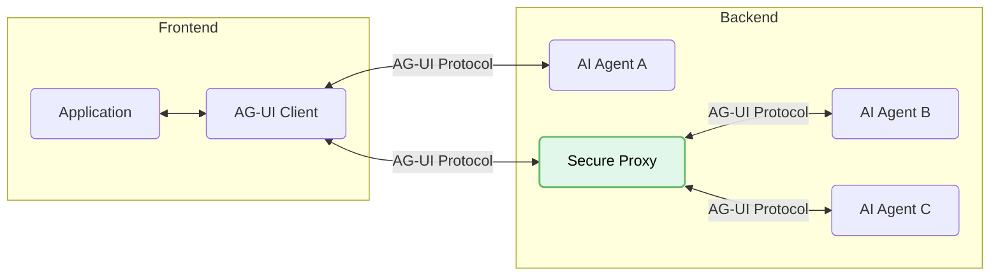

Agent User Interaction Protocol (AG-UI) is built on a flexible, event-driven
architecture that enables seamless, efficient communication between front-end
applications and AI agents. This document covers the core architectural
components and concepts.

## Overview

AG-UI follows a client-server architecture that standardizes communication
between agents and applications:



- **Application**: User-facing apps (i.e. chat or any AI-enabled application).
- **AG-UI Client**: Generic communication clients like `HttpAgent` or
  specialized clients for connecting to existing protocols.
- **Agents**: Backend AI agents that process requests and generate streaming
  responses.
- **Secure Proxy**: Backend services that provide additional capabilities and
  act as a secure proxy.

## Core components

### Protocol layer

AG-UI's protocol layer provides a flexible foundation for agent communication.

- **Universal compatibility**: Connect to any protocol by implementing
  `run(input: RunAgentInput) -> Observable<BaseEvent>`

The protocol's primary abstraction enables applications to run agents and
receive a stream of events:

{/* prettier-ignore */}
```typescript
// Core agent execution interface
type RunAgent = () => Observable<BaseEvent>

class MyAgent extends AbstractAgent {
  run(input: RunAgentInput): RunAgent {
    const { threadId, runId } = input
    return () =>
      from([
        { type: EventType.RUN_STARTED, threadId, runId },
        {
          type: EventType.MESSAGES_SNAPSHOT,
          messages: [
            { id: "msg_1", role: "assistant", content: "Hello, world!" }
          ],
        },
        { type: EventType.RUN_FINISHED, threadId, runId },
      ])
  }
}
```

### Standard HTTP client

AG-UI offers a standard HTTP client `HttpAgent` that can be used to connect to
any endpoint that accepts POST requests with a body of type `RunAgentInput` and
sends a stream of `BaseEvent` objects.

`HttpAgent` supports the following transports:

- **HTTP SSE (Server-Sent Events)**

  - Text-based streaming for wide compatibility
  - Easy to read and debug

- **HTTP binary protocol**
  - Highly performant and space-efficient custom transport
  - Robust binary serialization for production environments

### Message types

AG-UI defines several event categories for different aspects of agent
communication:

- **Lifecycle events**

  - `RUN_STARTED`, `RUN_FINISHED`, `RUN_ERROR`
  - `STEP_STARTED`, `STEP_FINISHED`

- **Text message events**

  - `TEXT_MESSAGE_START`, `TEXT_MESSAGE_CONTENT`, `TEXT_MESSAGE_END`

- **Tool call events**

  - `TOOL_CALL_START`, `TOOL_CALL_ARGS`, `TOOL_CALL_END`

- **State management events**

  - `STATE_SNAPSHOT`, `STATE_DELTA`, `MESSAGES_SNAPSHOT`

- **Special events**
  - `RAW`, `CUSTOM`

## Running Agents

To run an agent, you create a client instance and execute it:

```typescript
// Create an HTTP agent client
const agent = new HttpAgent({
  url: "https://your-agent-endpoint.com/agent",
  agentId: "unique-agent-id",
  threadId: "conversation-thread"
});

// Start the agent and handle events
agent.runAgent({
  tools: [...],
  context: [...]
}).subscribe({
  next: (event) => {
    // Handle different event types
    switch(event.type) {
      case EventType.TEXT_MESSAGE_CONTENT:
        // Update UI with new content
        break;
      // Handle other event types
    }
  },
  error: (error) => console.error("Agent error:", error),
  complete: () => console.log("Agent run complete")
});
```

## State Management

AG-UI provides efficient state management through specialized events:

- `STATE_SNAPSHOT`: Complete state representation at a point in time
- `STATE_DELTA`: Incremental state changes using JSON Patch format (RFC 6902)
- `MESSAGES_SNAPSHOT`: Complete conversation history

These events enable efficient client-side state management with minimal data
transfer.

## Tools and Handoff

AG-UI supports agent-to-agent handoff and tool usage through standardized
events:

- Tool definitions are passed in the `runAgent` parameters
- Tool calls are streamed as sequences of `TOOL_CALL_START` → `TOOL_CALL_ARGS` →
  `TOOL_CALL_END` events
- Agents can hand off to other agents, maintaining context continuity

## Events

All communication in AG-UI is based on typed events. Every event inherits from
`BaseEvent`:

```typescript
interface BaseEvent {
  type: EventType
  timestamp?: number
  rawEvent?: any
}
```

Events are strictly typed and validated, ensuring reliable communication between
components.
