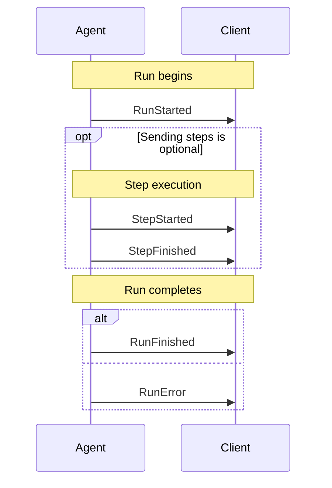
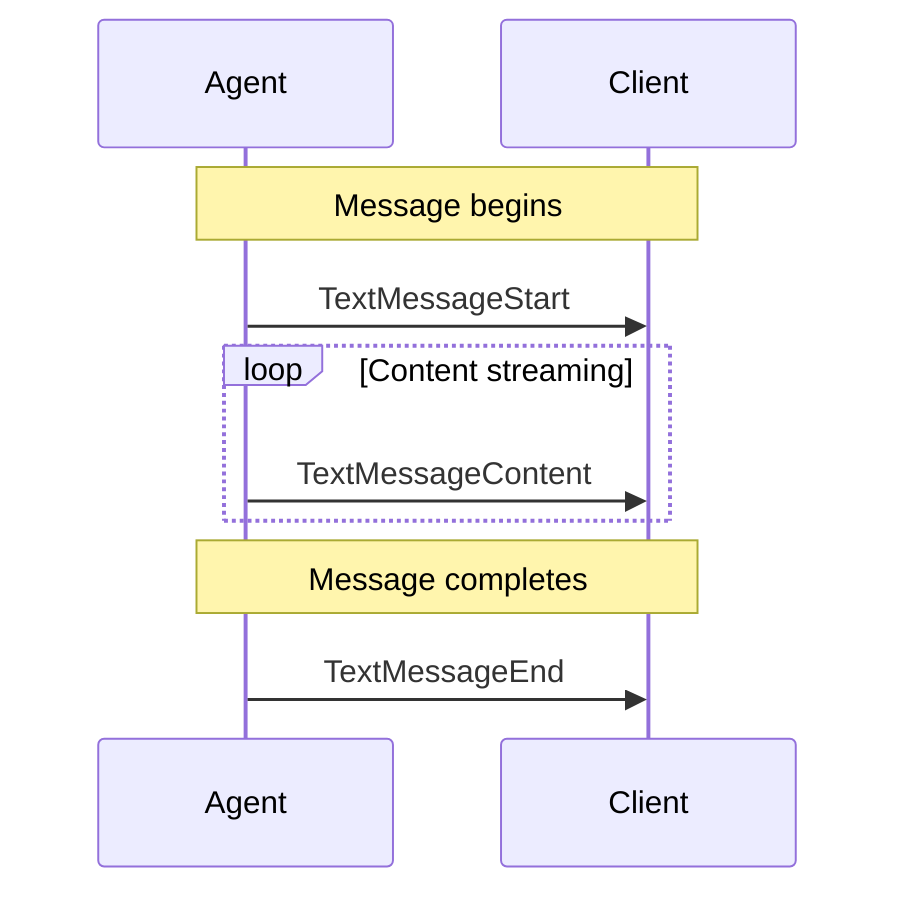
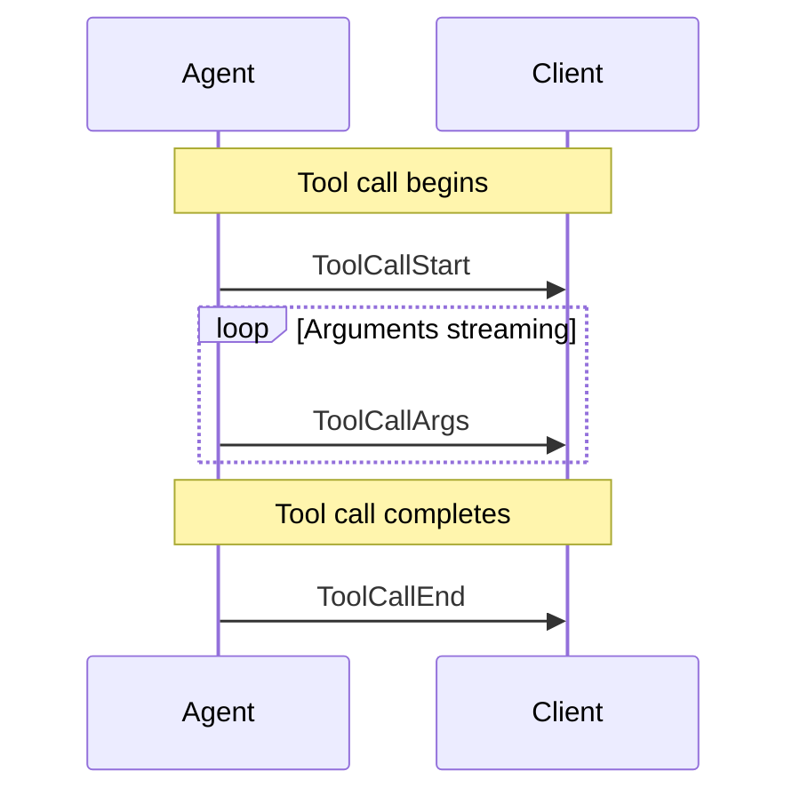
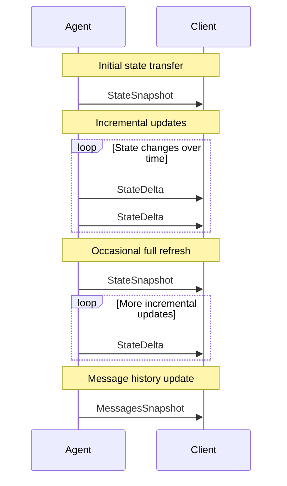

# Events

The Agent User Interaction Protocol uses a streaming event-based architecture.
Events are the fundamental units of communication between agents and frontends,
enabling real-time, structured interaction.

## Event Types Overview

Events in the protocol are categorized by their purpose:

| Category                | Description                             |
| ----------------------- | --------------------------------------- |
| Lifecycle Events        | Monitor the progression of agent runs   |
| Text Message Events     | Handle streaming textual content        |
| Tool Call Events        | Manage tool executions by agents        |
| State Management Events | Synchronize state between agents and UI |
| Special Events          | Support custom functionality            |

## Base Event Properties

All events share a common set of base properties:

| Property    | Description                                                      |
| ----------- | ---------------------------------------------------------------- |
| `type`      | The specific event type identifier                               |
| `timestamp` | Optional timestamp indicating when the event was created         |
| `rawEvent`  | Optional field containing the original event data if transformed |

## Lifecycle Events

These events represent the lifecycle of an agent run. A typical agent run
follows a predictable pattern: it begins with a `RunStarted` event, may contain
multiple optional `StepStarted`/`StepFinished` pairs, and concludes with either
a `RunFinished` event (success) or a `RunError` event (failure).

Lifecycle events provide crucial structure to agent runs, enabling frontends to
track progress, manage UI states appropriately, and handle errors gracefully.
They create a consistent framework for understanding when operations begin and
end, making it possible to implement features like loading indicators, progress
tracking, and error recovery mechanisms.

The `RunStarted` and either `RunFinished` or `RunError` events are mandatory,
forming the boundaries of an agent run. Step events are optional and may occur
multiple times within a run, allowing for structured, observable progress
tracking.

### RunStarted

Signals the start of an agent run.

The `RunStarted` event is the first event emitted when an agent begins
processing a request. It establishes a new execution context identified by a
unique `runId`. This event serves as a marker for frontends to initialize UI
elements such as progress indicators or loading states. It also provides crucial
identifiers that can be used to associate subsequent events with this specific
run.

| Property   | Description                   |
| ---------- | ----------------------------- |
| `threadId` | ID of the conversation thread |
| `runId`    | ID of the agent run           |

### RunFinished

Signals the successful completion of an agent run.

The `RunFinished` event indicates that an agent has successfully completed all
its work for the current run. Upon receiving this event, frontends should
finalize any UI states that were waiting on the agent's completion. This event
marks a clean termination point and indicates that no further processing will
occur in this run unless explicitly requested.

| Property   | Description                   |
| ---------- | ----------------------------- |
| `threadId` | ID of the conversation thread |
| `runId`    | ID of the agent run           |

### RunError

Signals an error during an agent run.

The `RunError` event indicates that the agent encountered an error it could not
recover from, causing the run to terminate prematurely. This event provides
information about what went wrong, allowing frontends to display appropriate
error messages and potentially offer recovery options. After a `RunError` event,
no further processing will occur in this run.

| Property  | Description         |
| --------- | ------------------- |
| `message` | Error message       |
| `code`    | Optional error code |

### StepStarted

Signals the start of a step within an agent run.

The `StepStarted` event indicates that the agent is beginning a specific subtask
or phase of its processing. Steps provide granular visibility into the agent's
progress, enabling more precise tracking and feedback in the UI. Steps are
optional but highly recommended for complex operations that benefit from being
broken down into observable stages. The `stepName` could be the name of a node
or function that is currently executing.

| Property   | Description      |
| ---------- | ---------------- |
| `stepName` | Name of the step |

### StepFinished

Signals the completion of a step within an agent run.

The `StepFinished` event indicates that the agent has completed a specific
subtask or phase. When paired with a corresponding `StepStarted` event, it
creates a bounded context for a discrete unit of work. Frontends can use these
events to update progress indicators, show completion animations, or reveal
results specific to that step. The `stepName` must match the corresponding
`StepStarted` event to properly pair the beginning and end of the step.

| Property   | Description      |
| ---------- | ---------------- |
| `stepName` | Name of the step |

## Text Message Events

These events represent the lifecycle of text messages in a conversation. Text
message events follow a streaming pattern, where content is delivered
incrementally. A message begins with a `TextMessageStart` event, followed by one
or more `TextMessageContent` events that deliver chunks of text as they become
available, and concludes with a `TextMessageEnd` event.

This streaming approach enables real-time display of message content as it's
generated, creating a more responsive user experience compared to waiting for
the entire message to be complete before showing anything.

The `TextMessageContent` events each contain a `delta` field with a chunk of
text. Frontends should concatenate these deltas in the order received to
construct the complete message. The `messageId` property links all related
events, allowing the frontend to associate content chunks with the correct
message.

### TextMessageStart

Signals the start of a text message.

The `TextMessageStart` event initializes a new text message in the conversation.
It establishes a unique `messageId` that will be referenced by subsequent
content chunks and the end event. This event allows frontends to prepare the UI
for an incoming message, such as creating a new message bubble with a loading
indicator. The `role` property identifies whether the message is coming from the
assistant or potentially another participant in the conversation.

| Property    | Description                                    |
| ----------- | ---------------------------------------------- |
| `messageId` | Unique identifier for the message              |
| `role`      | Role of the message sender (e.g., "assistant") |

### TextMessageContent

Represents a chunk of content in a streaming text message.

The `TextMessageContent` event delivers incremental parts of the message text as
they become available. Each event contains a small chunk of text in the `delta`
property that should be appended to previously received chunks. The streaming
nature of these events enables real-time display of content, creating a more
responsive and engaging user experience. Implementations should handle these
events efficiently to ensure smooth text rendering without visible delays or
flickering.

| Property    | Description                            |
| ----------- | -------------------------------------- |
| `messageId` | Matches the ID from `TextMessageStart` |
| `delta`     | Text content chunk (non-empty)         |

### TextMessageEnd

Signals the end of a text message.

The `TextMessageEnd` event marks the completion of a streaming text message.
After receiving this event, the frontend knows that the message is complete and
no further content will be added. This allows the UI to finalize rendering,
remove any loading indicators, and potentially trigger actions that should occur
after message completion, such as enabling reply controls or performing
automatic scrolling to ensure the full message is visible.

| Property    | Description                            |
| ----------- | -------------------------------------- |
| `messageId` | Matches the ID from `TextMessageStart` |

## Tool Call Events

These events represent the lifecycle of tool calls made by agents. Tool calls
follow a streaming pattern similar to text messages. When an agent needs to use
a tool, it emits a `ToolCallStart` event, followed by one or more `ToolCallArgs`
events that stream the arguments being passed to the tool, and concludes with a
`ToolCallEnd` event.

This streaming approach allows frontends to show tool executions in real-time,
making the agent's actions transparent and providing immediate feedback about
what tools are being invoked and with what parameters.

The `ToolCallArgs` events each contain a `delta` field with a chunk of the
arguments. Frontends should concatenate these deltas in the order received to
construct the complete arguments object. The `toolCallId` property links all
related events, allowing the frontend to associate argument chunks with the
correct tool call.

### ToolCallStart

Signals the start of a tool call.

The `ToolCallStart` event indicates that the agent is invoking a tool to perform
a specific function. This event provides the name of the tool being called and
establishes a unique `toolCallId` that will be referenced by subsequent events
in this tool call. Frontends can use this event to display tool usage to users,
such as showing a notification that a specific operation is in progress. The
optional `parentMessageId` allows linking the tool call to a specific message in
the conversation, providing context for why the tool is being used.

| Property          | Description                         |
| ----------------- | ----------------------------------- |
| `toolCallId`      | Unique identifier for the tool call |
| `toolCallName`    | Name of the tool being called       |
| `parentMessageId` | Optional ID of the parent message   |

### ToolCallArgs

Represents a chunk of argument data for a tool call.

The `ToolCallArgs` event delivers incremental parts of the tool's arguments as
they become available. Each event contains a segment of the argument data in the
`delta` property. These deltas are often JSON fragments that, when combined,
form the complete arguments object for the tool. Streaming the arguments is
particularly valuable for complex tool calls where constructing the full
arguments may take time. Frontends can progressively reveal these arguments to
users, providing insight into exactly what parameters are being passed to tools.

| Property     | Description                         |
| ------------ | ----------------------------------- |
| `toolCallId` | Matches the ID from `ToolCallStart` |
| `delta`      | Argument data chunk                 |

### ToolCallEnd

Signals the end of a tool call.

The `ToolCallEnd` event marks the completion of a tool call. After receiving
this event, the frontend knows that all arguments have been transmitted and the
tool execution is underway or completed. This allows the UI to finalize the tool
call display and prepare for potential results. In systems where tool execution
results are returned separately, this event indicates that the agent has
finished specifying the tool and its arguments, and is now waiting for or has
received the results.

| Property     | Description                         |
| ------------ | ----------------------------------- |
| `toolCallId` | Matches the ID from `ToolCallStart` |

## State Management Events

These events are used to manage and synchronize the agent's state with the
frontend. State management in the protocol follows an efficient snapshot-delta
pattern where complete state snapshots are sent initially or infrequently, while
incremental updates (deltas) are used for ongoing changes.

This approach optimizes for both completeness and efficiency: snapshots ensure
the frontend has the full state context, while deltas minimize data transfer for
frequent updates. Together, they enable frontends to maintain an accurate
representation of agent state without unnecessary data transmission.

The combination of snapshots and deltas allows frontends to efficiently track
changes to agent state while ensuring consistency. Snapshots serve as
synchronization points that reset the state to a known baseline, while deltas
provide lightweight updates between snapshots.

### StateSnapshot

Provides a complete snapshot of an agent's state.

The `StateSnapshot` event delivers a comprehensive representation of the agent's
current state. This event is typically sent at the beginning of an interaction
or when synchronization is needed. It contains all state variables relevant to
the frontend, allowing it to completely rebuild its internal representation.
Frontends should replace their existing state model with the contents of this
snapshot rather than trying to merge it with previous state.

| Property   | Description             |
| ---------- | ----------------------- |
| `snapshot` | Complete state snapshot |

### StateDelta

Provides a partial update to an agent's state using JSON Patch.

The `StateDelta` event contains incremental updates to the agent's state in the
form of JSON Patch operations (as defined in RFC 6902). Each delta represents
specific changes to apply to the current state model. This approach is
bandwidth-efficient, sending only what has changed rather than the entire state.
Frontends should apply these patches in sequence to maintain an accurate state
representation. If a frontend detects inconsistencies after applying patches, it
may request a fresh `StateSnapshot`.

| Property | Description                               |
| -------- | ----------------------------------------- |
| `delta`  | Array of JSON Patch operations (RFC 6902) |

### MessagesSnapshot

Provides a snapshot of all messages in a conversation.

The `MessagesSnapshot` event delivers a complete history of messages in the
current conversation. Unlike the general state snapshot, this focuses
specifically on the conversation transcript. This event is useful for
initializing the chat history, synchronizing after connection interruptions, or
providing a comprehensive view when a user joins an ongoing conversation.
Frontends should use this to establish or refresh the conversational context
displayed to users.

| Property   | Description              |
| ---------- | ------------------------ |
| `messages` | Array of message objects |

## Special Events

Special events provide flexibility in the protocol by allowing for
system-specific functionality and integration with external systems. These
events don't follow the standard lifecycle or streaming patterns of other event
types but instead serve specialized purposes.

### Raw

Used to pass through events from external systems.

The `Raw` event acts as a container for events originating from external systems
or sources that don't natively follow the Agent UI Protocol. This event type
enables interoperability with other event-based systems by wrapping their events
in a standardized format. The enclosed event data is preserved in its original
form inside the `event` property, while the optional `source` property
identifies the system it came from. Frontends can use this information to handle
external events appropriately, either by processing them directly or by
delegating them to system-specific handlers.

| Property | Description                |
| -------- | -------------------------- |
| `event`  | Original event data        |
| `source` | Optional source identifier |

### Custom

Used for application-specific custom events.

The `Custom` event provides an extension mechanism for implementing features not
covered by the standard event types. Unlike `Raw` events which act as
passthrough containers, `Custom` events are explicitly part of the protocol but
with application-defined semantics. The `name` property identifies the specific
custom event type, while the `value` property contains the associated data. This
mechanism allows for protocol extensions without requiring formal specification
changes. Teams should document their custom events to ensure consistent
implementation across frontends and agents.

| Property | Description                     |
| -------- | ------------------------------- |
| `name`   | Name of the custom event        |
| `value`  | Value associated with the event |

## Event Flow Patterns

Events in the protocol typically follow specific patterns:

1. **Start-Content-End Pattern**: Used for streaming content (text messages,
   tool calls)

   - `Start` event initiates the stream
   - `Content` events deliver data chunks
   - `End` event signals completion

2. **Snapshot-Delta Pattern**: Used for state synchronization

   - `Snapshot` provides complete state
   - `Delta` events provide incremental updates

3. **Lifecycle Pattern**: Used for monitoring agent runs
   - `Started` events signal beginnings
   - `Finished`/`Error` events signal endings

## Implementation Considerations

When implementing event handlers:

- Events should be processed in the order they are received
- Events with the same ID (e.g., `messageId`, `toolCallId`) belong to the same
  logical stream
- Implementations should be resilient to out-of-order delivery
- Custom events should follow the established patterns for consistency
